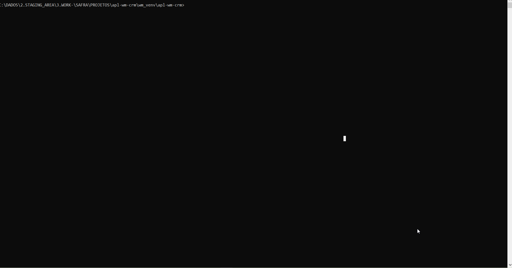
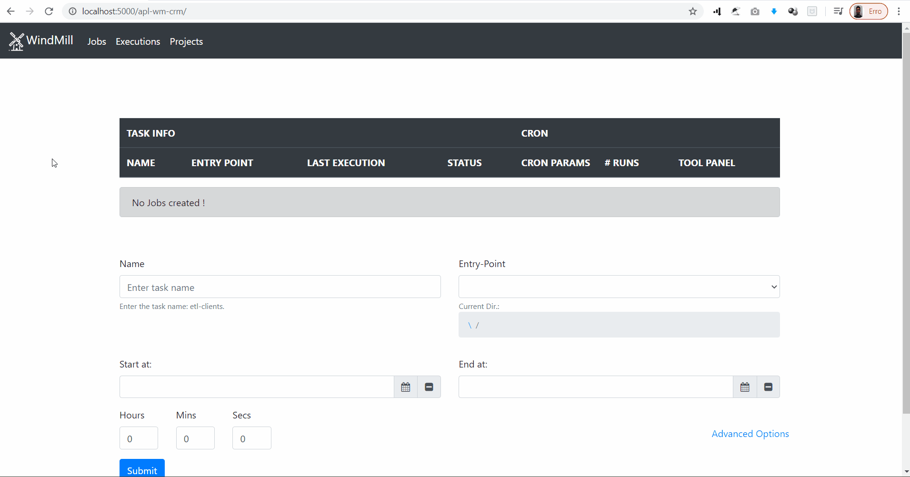
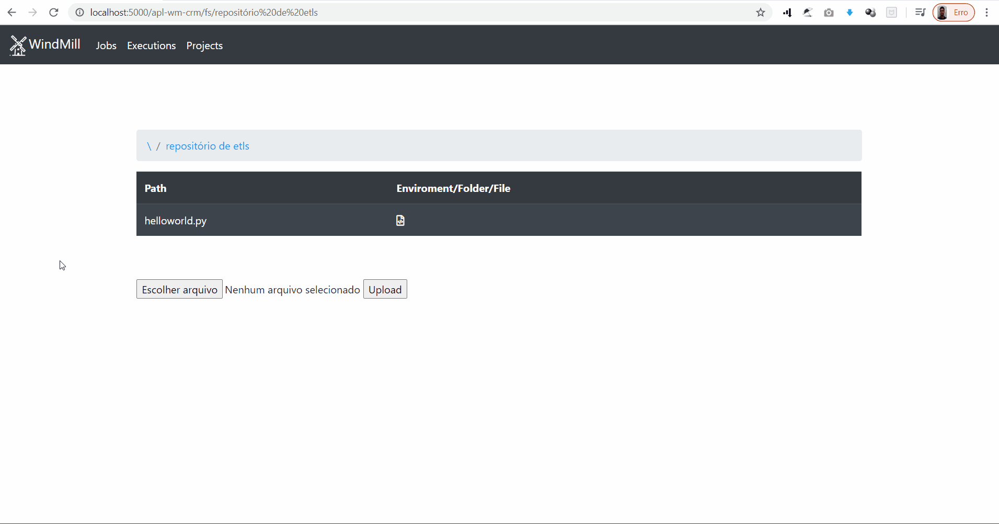

 


<p align="center"></p>

# WindMill (beta)

Controle de Jobs Eficiente

### Descrição
O Projeto Windmill é um projeto open-source cuja finalidade é prover uma ferramenta de controle para a execução de Jobs escritos em *Python*. Com o WindMill você pode **iniciar** a execução de um job, **parar** a execução de um job ativo ou ainda **agendar** para o job executar de tempos em tempos, numa interface web amigável.

Todas as execuções dos Jobs ficam registradas e você pode verificar as mensagens de saída do seu Job **como se fosse no seu terminal !**. Você não precisa incluir nenhuma biblioteca ou utilizar nenhuma função diferente do ```print```.

### Conteúdo
1. Instalação
2. Primeiros passos com WindMill
3. Guia de Contribuição
4. Créditos
5. Licença
6. Exemplos
7. Troubleshooting
8. FAQ (?)

### 1. Instalação
O WindMill é um projeto que implementa um servidor ```Flask ``` para controlar a execução dos Jobs. O Projeto faz uso de algumas tecnologias incríveis como:
- [Flask](https://flask.palletsprojects.com/en/1.1.x/) - como servidor Python da Aplicação;
- [APScheduler](https://apscheduler.readthedocs.io/en/stable/) - para agendamento dos Jobs;
- [MongoDB](https://www.mongodb.com/) - como banco de dados;
- [Pipenv](https://pipenv-fork.readthedocs.io/en/latest/) - para gerenciamento dos ambientes virtuais.

Para instalar essas bibliotecas e todas as suas dependências basta entrar na pasta do projeto e com o seu terminal favorito executar:

```pip install -r requirements.txt```

**Obs.:**
1. *O Arquivo requirements.txt é o arquivo que descreve todas as bibliotecas e suas respectivas versões que são dependências para o funcionamento da ferramenta WindMill*
2. *Sua versão do Python precisa ser igual ou superior a **3.6** e o seu **pip** precisa estar atualizado. Em caso de dúvidas recorra a seção de [Troubleshooting](#)*

### 2. Primeiros passos com WindMill
#### 2.1. Iniciando o WindMill
O WindMill é uma ferramenta para o controle da execução de Jobs. Para iniciar o WindMill basta acessar a pasta do projeto e com o terminal, digitar com o comando:
```python run.py```
Ele iniciará o servidor do WindMill por padrão no endereço: [localhost:5000](localhost:5000).
A página inicial já é a tela de visualização dos Jobs



#### 2. 2 Projetos, Jobs e Execuções
Projetos, Jobs e Execuções são as principais entidades por trás do WindMill.
A ideia é a partir de um ***projeto*** criar um conjunto de ***jobs***, onde esses jobs podem partilhar algumas bibliotecas próprias, arquivos de configuração, arquivos de dados e etc.
Tendo um criado um projeto criam-se então os jobs, que são configurados para executar um **script python** que é o *"ponto-de-entrada"* da execução. Cada job possui seu arquivo de "ponto-de-entrada".
Assim que o job for criado, o usuário poderá então executá-lo, seja manualmente ou automaticamente através do *agendamento da execução*. Cada vez que um determinado ***Job*** for executado, sua ***execução*** será registrada no banco de dados, bem como todos os outputs (da saída padrão ou da saída de erro), e cada execução poderá ser consultada através da página de execuções.

#### 2.3 Criando um Projeto

Para criar um projeto, acesse a página de Projetos e clique no botão de "Escolher arquivo". Você pode fazer o upload de um arquivo zip contendo todos os arquivos importantes para seus Jobs ou ainda um único arquivo python.

Uma vez que você subiu seja o seu zip seja seu script python, eles estarão disponíveis para serem usados para criação de Jobs !



#### 2.4 Criando um Job

Para criar um Job, você precisa ter criando um projeto. Uma vez que o projeto está criado, basta ir na tela de Jobs e entrar com o nome do Job e selecionar o arquivo "ponto-de-entrada" do Job. Para selecionar o arquivo basta usar o dropdown com a navegação para o arquivo (como se fosse o *sistema de arquivos de um SO*).
Caso você pretenda **agendar a execução** do seu job, basta completar as informações de agendamento (todas opcionais) entrando com os dados do início da execução, término da execução, e qual intervalo de tempo você deseja que a execução do job seja feita (em horas, minutos e segundos).

***Obs.: Caso a execução leve mais tempo do que o intervalo de tempo cadastrado, seu Job será executado novamente imediatamente após a execução do anterior.***
*Exemplo: Job 1 - Deveria ser executado a cada 1 hora (00:00, 01:00, 02:00, 03:00, ...), só que por conta da quantidade de tarefas que ele realiza, sua execução, na média, costuma ser de 1 hora e 1/2. Logo esse job será executado às 00:00, 01:30, 03:00, ...*

#### 2.5 Avaliando a Execução do Job

Assim que um job tiver sido criado,  você poderá executá-lo 1 única vez, clicando no botão de play, ou executar N vezes de acordo com o tempo do agendamento. Cada execução irá gerar um novo registro no banco de dados e você pode consultar as execuções na página de execuções.



#### 2.6 Outras ações para Projetos e Jobs

O usuário pode excluir Projetos, mas não alterá-los. Para excluir basta clicar no ícone da lixeira do projeto, na página de Projetos.

Para os Jobs, o usuário pode alterar um Job, **desde que esse não tenha sido executado** clicando no ícone do papel-e-caneta, e pode excluir um Job clicando no ícone da lixeira.

### 3.  Guia de Contribuição

Antes de contribuir com uma nova ideia ou com alterações no código, verifique se já existe uma alteração em andamento no *roadmap* ou *backlog* do projeto.

Para contribuir com o projeto WindMill, basta o desenvolvedor fazer um fork na última versão estável do projeto do GitHub, fazer suas alterações e solicitar um pull-request com a descrição das suas alterações.

Caso você não queira desenvolver as alterações, você pode solicitar ao time de desenvolvimento da ferramenta WindMill que irá avaliá-la e colocar em alguma das filas de desenvolvimento.

### 4. Créditos

O Projeto WindMill foi inspirado em projetos como o Apache Airflow e o Cronitor.
O WindMill foi implantado em Python usando bibliotecas fantásticas como Flask, APScheduler e o Pipenv.
O Time de DataViz do Banco Safra teve um papel fundamental no desenvolvimento dessa ferramenta, no suporte e esclarecimento de dúvidas.

### 5. Licença

O Projeto WindMill está licenciado sob a licença *BSD 3*.

### 6. Exemplos

Consulte a pasta [Exemplos](examples/)

Nela entre outros exemplos você vai encontrar arquivos que exemplifiquem as seguintes situações:

- error.py: Ao executar esse Job, você verá o erro na tela de execução de Jobs;
- helloworld.py: Simples Job Hello World!;
- request.py: Esse arquivo faz uma requisição a um site e retorna uma resposta. Esse arquivo exemplifica um simples _crawler_;
- sleepwalking.py: Esse arquivo mostra que a tela de execução de Jobs pode refletir imediatamente a saída de um script.

### 7. Troubleshooting

Iremos criar em breve

### 8. FAQ

- Para o que eu usaria essa ferramenta ?
> O WindMill pode ser usado para controlar a execução de scripts python. Caso você tenha uma tarefa que pode ser resolvida através de um script python (e um monte de tarefas podem ser resolvidas assim: [Automating w/ Python](https://automatetheboringstuff.com/)]) o WindMill pode te ajudar a controlar quando e quantas vezes a tarefa será executada.

- O que é exatamente um Projeto?
> Um projeto nada mais é do que uma pasta com alguns arquivos dentro, ou somente um único arquivo python. Um projeto deve ter pelo menos um arquivo python que será o "ponto-de-entrada" da aplicação, ou seja, será o primeiro arquivo a ser executado quando o seu Job iniciar.

- E o que é um Job?
> Pense em um Job como sendo um "Plano de Execução". Nesse "plano", você especifica um nome, um arquivo que será executado quando esse plano iniciar a execução e outras informações como de quanto em quanto tempo você quer que esse plano seja executado.

- Se o Job é um "Plano de Execução", o que é uma Execução?
> Uma execução é uma execução :)
> Piada a parte, uma execução é uma instância de um Plano de Execução. Depois que você definiu o plano de execução, você o executa, certo? Então, para ver como esse plano foi executado efetivamente, o que ele gerou de saídas ou erros, você confere a execução, ou seja, um Log daquela execução.


Quaisquer dúvidas, sugestões e críticas podem ser encaminhadas para: lukasavicus@gmail.com

---
Projeto Windmill
