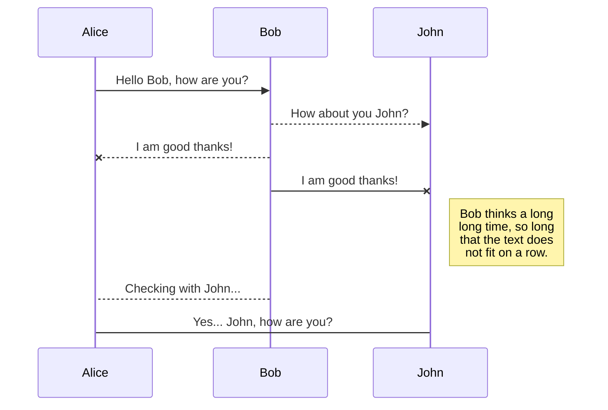
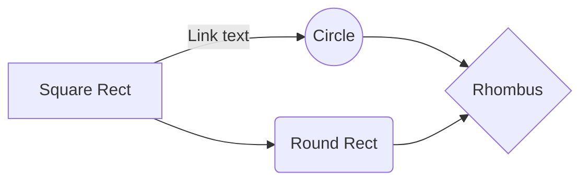

# WindMill - Controle de Jobs Eficiente

### Descrição
O Projeto Windmill é um projeto open-source cuja finalidade é prover uma ferramenta de controle para a execução de Jobs escritos em *Python*. Com o WindMill você pode **iniciar** a execução de um job, **parar** a execução de um job ativo ou ainda **agendar** para o job executar de tempos em tempos, numa interface web amigável.

Todas as execuções dos Jobs ficam registradas e você pode verificar as mensagens de saída do seu Job **como se fosse no seu terminal !**. Você não precisa incluir nenhuma biblioteca ou utilizar nenhuma função diferente do ```print```.

### Conteúdo
1. Instalação
2. Primeiros passos com WindMill
3. Guia de Contribuição
4. Créditos
5. Licença
6. Exemplos
7. Troubleshooting
8. FAQ (?)

### 1. Instalação
O WindMill é um projeto que implementa um servidor ```Flask ``` para controlar a execução dos Jobs. O Projeto faz uso de algumas tecnologias incríveis como:
- [Flask](https://flask.palletsprojects.com/en/1.1.x/) - como servidor Python da Aplicação;
- [APScheduler](https://apscheduler.readthedocs.io/en/stable/) - para agendamento dos Jobs;
- [MongoDB](https://www.mongodb.com/) - como banco de dados;
- [Pipenv](https://pipenv-fork.readthedocs.io/en/latest/) - para gerenciamento dos ambientes virtuais.

Para instalar essas bibliotecas e todas as suas dependências basta entrar na pasta do projeto e com o seu terminal favorito executar:

```pip install -r requirements.txt```

**Obs.:**
1. *O Arquivo requirements.txt é o arquivo que descreve todas as bibliotecas e suas respectivas versões que são dependências para o funcionamento da ferramenta WindMill*
2. *Sua versão do Python precisa ser igual ou superior a **3.6** e o seu **pip** precisa estar atualizado. Em caso de dúvidas recorra a seção de [Troubleshooting](#)*

### 2. Primeiros passos com WindMill
#### 2.1. Iniciando o WindMill
O WindMill é uma ferramenta para o controle da execução de Jobs. Para iniciar o WindMill basta acessar a pasta do projeto e com o terminal, digitar com o comando:
```python run.py```
Ele iniciará o servidor do WindMill por padrão no endereço: [localhost:5000](localhost:5000).
A página inicial já é a tela de visualização dos Jobs

#### 2. 2 Projetos, Jobs e Execuções
Projetos, Jobs e Execuções são as principais entidades por trás do WindMill.
A ideia é a partir de um ***projeto*** criar um conjunto de ***jobs***, onde esses jobs podem partilhar algumas bibliotecas próprias, arquivos de configuração, arquivos de dados e etc.
Tendo um criado um projeto criam-se então os jobs, que são configurados para executar um **script python** que é o *"ponto-de-entrada"* da execução. Cada job possui seu arquivo de "ponto-de-entrada".
Assim que o job for criado, o usuário poderá então executá-lo, seja manualmente ou automaticamente através do *agendamento da execução*. Cada vez que um determinado ***Job*** for executado, sua ***execução*** será registrada no banco de dados, bem como todos os outputs (da saída padrão ou da saída de erro), e cada execução poderá ser consultada através da página de execuções.

#### 2.3 Criando um Projeto

Para criar um projeto, acesse a página de Projetos e clique no botão de "Escolher arquivo". Você pode fazer o upload de um arquivo zip contendo todos os arquivos importantes para seus Jobs ou ainda um único arquivo python.

Uma vez que você subiu seja o seu zip seja seu script python, eles estarão disponíveis para serem usados para criação de Jobs !

#### 2.4 Criando um Job

Para criar um Job, você precisa ter criando um projeto. Uma vez que o projeto está criado, basta ir na tela de Jobs e entrar com o nome do Job e selecionar o arquivo "ponto-de-entrada" do Job. Para selecionar o arquivo basta usar o dropdown com a navegação para o arquivo (como se fosse o *sistema de arquivos de um SO*).
Caso você pretenda **agendar a execução** do seu job, basta completar as informações de agendamento (todas opcionais) entrando com os dados do início da execução, término da execução, e qual intervalo de tempo você deseja que a execução do job seja feita (em horas, minutos e segundos).

***Obs.: Caso a execução leve mais tempo do que o intervalo de tempo cadastrado, seu Job será executado novamente imediatamente após a execução do anterior.***
*Exemplo: Job 1 - Deveria ser executado a cada 1 hora (00:00, 01:00, 02:00, 03:00, ...), só que por conta da quantidade de tarefas que ele realiza, sua execução, na média, costuma ser de 1 hora e 1/2. Logo esse job será executado às 00:00, 01:30, 03:00, ...*

#### 2.x Avaliando a Execução do Job


Hi! I'm your first Markdown file in **StackEdit**. If you want to learn about StackEdit, you can read me. If you want to play with Markdown, you can edit me. Once you have finished with me, you can create new files by opening the **file explorer** on the left corner of the navigation bar.

## Export a file

You can export the current file by clicking **Export to disk** in the menu. You can choose to export the file as plain Markdown, as HTML using a Handlebars template or as a PDF.


# Synchronization

Synchronization is one of the biggest features of StackEdit. It enables you to synchronize any file in your workspace with other files stored in your **Google Drive**, your **Dropbox** and your **GitHub** accounts. This allows you to keep writing on other devices, collaborate with people you share the file with, integrate easily into your workflow... The synchronization mechanism takes place every minute in the background, downloading, merging, and uploading file modifications.

There are two types of synchronization and they can complement each other:

- The workspace synchronization will sync all your files, folders and settings automatically. This will allow you to fetch your workspace on any other device.
	> To start syncing your workspace, just sign in with Google in the menu.

- The file synchronization will keep one file of the workspace synced with one or multiple files in **Google Drive**, **Dropbox** or **GitHub**.
	> Before starting to sync files, you must link an account in the **Synchronize** sub-menu.

## Open a file

You can open a file from **Google Drive**, **Dropbox** or **GitHub** by opening the **Synchronize** sub-menu and clicking **Open from**. Once opened in the workspace, any modification in the file will be automatically synced.

## Save a file

You can save any file of the workspace to **Google Drive**, **Dropbox** or **GitHub** by opening the **Synchronize** sub-menu and clicking **Save on**. Even if a file in the workspace is already synced, you can save it to another location. StackEdit can sync one file with multiple locations and accounts.

## Synchronize a file

Once your file is linked to a synchronized location, StackEdit will periodically synchronize it by downloading/uploading any modification. A merge will be performed if necessary and conflicts will be resolved.

If you just have modified your file and you want to force syncing, click the **Synchronize now** button in the navigation bar.

> **Note:** The **Synchronize now** button is disabled if you have no file to synchronize.

## Manage file synchronization

Since one file can be synced with multiple locations, you can list and manage synchronized locations by clicking **File synchronization** in the **Synchronize** sub-menu. This allows you to list and remove synchronized locations that are linked to your file.


# Publication

Publishing in StackEdit makes it simple for you to publish online your files. Once you're happy with a file, you can publish it to different hosting platforms like **Blogger**, **Dropbox**, **Gist**, **GitHub**, **Google Drive**, **WordPress** and **Zendesk**. With [Handlebars templates](http://handlebarsjs.com/), you have full control over what you export.

> Before starting to publish, you must link an account in the **Publish** sub-menu.

## Publish a File

You can publish your file by opening the **Publish** sub-menu and by clicking **Publish to**. For some locations, you can choose between the following formats:

- Markdown: publish the Markdown text on a website that can interpret it (**GitHub** for instance),
- HTML: publish the file converted to HTML via a Handlebars template (on a blog for example).

## Update a publication

After publishing, StackEdit keeps your file linked to that publication which makes it easy for you to re-publish it. Once you have modified your file and you want to update your publication, click on the **Publish now** button in the navigation bar.

> **Note:** The **Publish now** button is disabled if your file has not been published yet.

## Manage file publication

Since one file can be published to multiple locations, you can list and manage publish locations by clicking **File publication** in the **Publish** sub-menu. This allows you to list and remove publication locations that are linked to your file.


# Markdown extensions

StackEdit extends the standard Markdown syntax by adding extra **Markdown extensions**, providing you with some nice features.

> **ProTip:** You can disable any **Markdown extension** in the **File properties** dialog.


## SmartyPants

SmartyPants converts ASCII punctuation characters into "smart" typographic punctuation HTML entities. For example:

|                |ASCII                          |HTML                         |
|----------------|-------------------------------|-----------------------------|
|Single backticks|`'Isn't this fun?'`            |'Isn't this fun?'            |
|Quotes          |`"Isn't this fun?"`            |"Isn't this fun?"            |
|Dashes          |`-- is en-dash, --- is em-dash`|-- is en-dash, --- is em-dash|


## KaTeX

You can render LaTeX mathematical expressions using [KaTeX](https://khan.github.io/KaTeX/):

The *Gamma function* satisfying $\Gamma(n) = (n-1)!\quad\forall n\in\mathbb N$ is via the Euler integral

$$
\Gamma(z) = \int_0^\infty t^{z-1}e^{-t}dt\,.
$$

> You can find more information about **LaTeX** mathematical expressions [here](http://meta.math.stackexchange.com/questions/5020/mathjax-basic-tutorial-and-quick-reference).


## UML diagrams

You can render UML diagrams using [Mermaid](https://mermaidjs.github.io/). For example, this will produce a sequence diagram:



And this will produce a flow chart:


